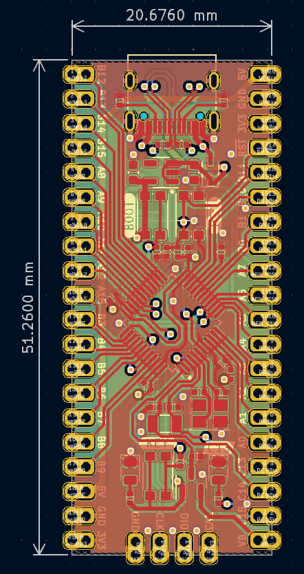
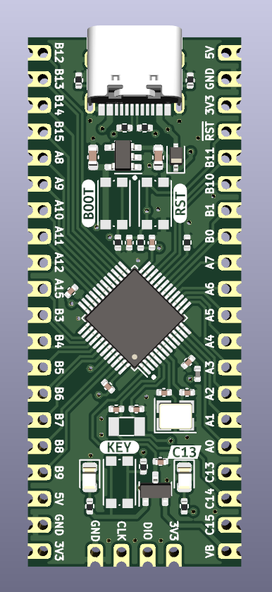
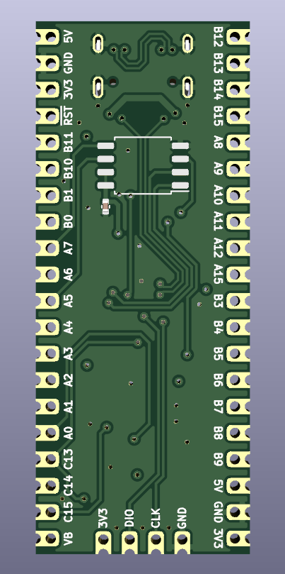

# STM32F103 Bluepill USB C #
STM32F103 Bluepill PCB with USB C and castellated PCB.

## Warning ##
After finished and ordering from `JLCPCB` I spotted a mistake that I swapped USB D- with D+ and vice versa.

## Problem fixed ##
* [ ] Fixing swapped D- D+ USB trace

## Bluepill USB C PCB ##

